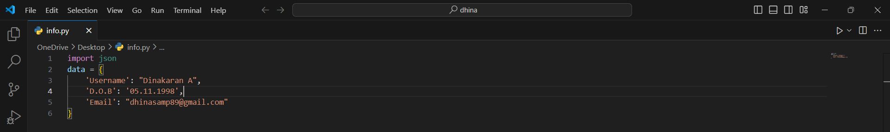

<h1 align="center">Hi 👋, I'm Dinakaran</h1>

<h3 align="center">A passionate Hacker from India</h3>

  

<h3>About:</h3>

- I’m good at developing Front-End

- I am fascinated and more passionate in Cyber Security/Investigation/Hacking.

- Working in Cybersecurity projects.

- Read my articles on <a href="https://medium.com/@dhinasamp89">dhinasamp/medium.</a>

- Reach me at <a href="mailto:dhinasamp89@gmail.com">dhinasamp89@gmail.com</a>

<h3 align="left">Connect with me:</h3>

### **Programming Languages:**

#### **Front-End Web Technologies::**

#### **Back-End Web Technologies::**

#### **Frameworks:**

#### **Database:**

#### **Version-control:**

#### **OS:**

#### **Hardware:**

&nbsp;

