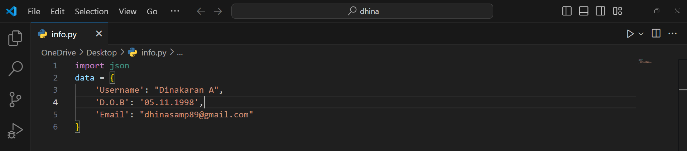

<h1 align="center">Hi 👋, I'm Dinakaran</h1>

<h3 align="center">A passionate Hacker from India</h3>

  

<h3 align="left">Connect with me:</h3>

- 🔥 I’m good at developing Front-End
- I am fascinated and more passionate in Cyber Security/Investigation/Hacking.

### **Programming Languages:**

#### **Front-End Web Technologies::**
](https://skillicons.dev)
#### **Back-End Web Technologies::**
](https://skillicons.dev)
#### **Frameworks:**
](https://skillicons.dev)
#### **Database:**
](https://skillicons.dev)
#### **Version-control:**
](https://skillicons.dev)
#### **OS:**

#### **Hardware:**

